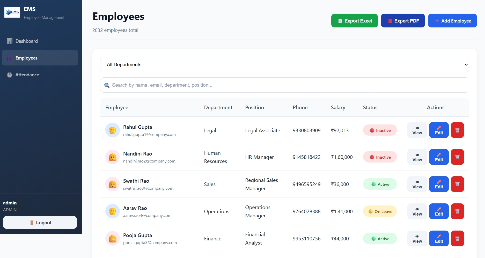

# 🚀 Employee Management System (EMS)

A modern **Full-Stack Employee Management System** built using **Java, Spring Boot, React.js, MongoDB Atlas, Spring Security, and JWT Authentication**.

The application enables organizations to efficiently manage employee records, attendance, departments, salary information, and workforce statistics through a secure and responsive web interface.

---

## 🌐 Live Demo

### Frontend Application

https://employee-management-system-sandy-iota.vercel.app

### Backend API

https://employee-management-backend-9ezw.onrender.com

> The backend is hosted on Render's free tier, so the first request may take some time if the service has been inactive.

---

## 📌 Features

### 🔐 Authentication & Security

* Secure JWT-based authentication
* Login and logout functionality
* Role-Based Access Control
* Admin, Manager, and User roles
* BCrypt password hashing
* Protected REST API endpoints
* Stateless session management
* CORS configuration

### 👨‍💼 Employee Management

* Add new employees
* Update employee details
* Delete employees
* View employee information
* Search employees
* Filter employees by department
* Track employee status
* Manage salary information
* Store joining date and contact details

### 📅 Attendance Management

* Mark employees as Present, Absent, or Leave
* Date-based attendance tracking
* Search attendance records
* Filter attendance by department
* Filter attendance by date
* Filter employees by attendance status
* Update existing attendance records
* Prevent duplicate attendance entries for the same employee and date

### 📊 Dashboard

* Total Employees
* Active Employees
* Present Today
* Absent Today
* Employees on Leave
* Total Payroll Statistics
* Department Overview
* Department Distribution Charts
* Recent Employees
* Real-time workforce statistics

### 💰 Payroll & Salary

* Total payroll calculation
* Employee salary management
* Payroll overview statistics

### 📱 User Interface

* Responsive design
* Modern admin dashboard
* Professional login screen
* Interactive statistic cards
* Search and filtering interface
* Responsive employee tables
* Attendance management dashboard
* Attractive charts and visual statistics

---

## 🛠 Tech Stack

### Frontend

* React.js
* JavaScript
* React Router
* Axios
* CSS3
* HTML5

### Backend

* Java 17
* Spring Boot
* Spring Security
* Spring Data MongoDB
* JWT Authentication
* RESTful APIs
* Maven

### Database

* MongoDB
* MongoDB Atlas

### Deployment & DevOps

* Vercel — Frontend Deployment
* Render — Backend Deployment
* MongoDB Atlas — Cloud Database
* Docker — Backend Containerization

### Development Tools

* Git
* GitHub
* VS Code
* Postman
* Maven
* npm

---

## 🏗 System Architecture

```text
┌──────────────────────────────┐
│      React.js Frontend       │
│       Hosted on Vercel       │
└──────────────┬───────────────┘
               │
               │ HTTPS / REST API
               │ JWT Authentication
               ▼
┌──────────────────────────────┐
│    Spring Boot Backend       │
│      Hosted on Render        │
│    Docker Containerized      │
└──────────────┬───────────────┘
               │
               │ Spring Data MongoDB
               ▼
┌──────────────────────────────┐
│       MongoDB Atlas          │
│      Cloud Database          │
└──────────────────────────────┘
```

---

## 🔄 Application Flow

```text
User
  │
  ▼
React.js Frontend
  │
  │ REST API Requests
  │ Authorization: Bearer <JWT>
  ▼
Spring Boot REST API
  │
  ├── Spring Security
  ├── JWT Authentication
  ├── Employee Management
  ├── Attendance Management
  └── Dashboard Statistics
  │
  ▼
MongoDB Atlas
```

---

## 📂 Project Structure

The application uses separate frontend and backend repositories.

### Frontend Structure

```text
employee-management-system/
│
├── public/
│   ├── favicon.png
│   └── index.html
│
├── src/
│   ├── components/
│   ├── pages/
│   ├── services/
│   │   └── api.js
│   ├── context/
│   ├── assets/
│   ├── App.js
│   └── index.js
│
├── package.json
└── README.md
```

### Backend Structure

```text
employee-management-backend/
│
├── src/
│   └── main/
│       ├── java/
│       │   └── com/ems/
│       │       ├── config/
│       │       ├── controller/
│       │       ├── dto/
│       │       ├── model/
│       │       ├── repository/
│       │       └── service/
│       │
│       └── resources/
│           └── application.properties
│
├── Dockerfile
├── pom.xml
└── README.md
```

---

## 🔌 REST API Endpoints

### Authentication APIs

| Method | Endpoint | Description |
|---|---|---|
| POST | `/api/auth/login` | Authenticate user and generate JWT |
| POST | `/api/auth/register` | Register a new user |

### Employee APIs

| Method | Endpoint | Description |
|---|---|---|
| GET | `/api/employees` | Get all employees |
| GET | `/api/employees/{id}` | Get employee by ID |
| POST | `/api/employees` | Create a new employee |
| PUT | `/api/employees/{id}` | Update employee details |
| DELETE | `/api/employees/{id}` | Delete employee |
| GET | `/api/employees/search?keyword=` | Search employees |
| GET | `/api/employees/departments` | Get all departments |
| GET | `/api/employees/dashboard/stats` | Get dashboard statistics |

### Attendance APIs

| Method | Endpoint | Description |
|---|---|---|
| GET | `/api/attendance` | Get all attendance records |
| POST | `/api/attendance` | Create or update attendance |

---

## ⚙️ Local Installation

### Prerequisites

Make sure the following are installed:

* Java 17 or later
* Maven
* Node.js
* npm
* Git
* MongoDB Atlas account

---

## 🔧 Backend Setup

Clone the backend repository:

```bash
git clone https://github.com/KothintiTharun035/employee-management-backend.git
```

Move into the backend directory:

```bash
cd employee-management-backend
```

Configure the required environment variables.

### Windows PowerShell

```powershell
$env:MONGODB_URI="your_mongodb_atlas_connection_string"
$env:JWT_SECRET="your_secure_jwt_secret"
```

Build the application:

```bash
mvn clean install
```

Run the backend:

```bash
mvn spring-boot:run
```

The backend runs locally at:

```text
http://localhost:8080
```

---

## 🎨 Frontend Setup

Clone the frontend repository:

```bash
git clone https://github.com/KothintiTharun035/employee-management-system.git
```

Move into the frontend directory:

```bash
cd employee-management-system
```

Install dependencies:

```bash
npm install
```

Start the React application:

```bash
npm start
```

The frontend runs locally at:

```text
http://localhost:3000
```

---

## 🔐 Environment Variables

The backend requires the following environment variables:

```text
MONGODB_URI
JWT_SECRET
```

Example Spring Boot configuration:

```properties
spring.application.name=employee-management-system

server.port=${PORT:10000}
server.address=0.0.0.0

spring.data.mongodb.uri=${MONGODB_URI}
spring.data.mongodb.auto-index-creation=true

app.jwt.secret=${JWT_SECRET}
app.jwt.expiration=86400000
```

> ⚠️ Never commit MongoDB passwords, database connection strings, JWT secrets, or other credentials to GitHub.

---

## 🐳 Docker Deployment

The Spring Boot backend is containerized using Docker.

Example Dockerfile:

```dockerfile
FROM maven:3.9.9-eclipse-temurin-17 AS build

WORKDIR /app

COPY pom.xml .

RUN mvn dependency:go-offline

COPY src ./src

RUN mvn clean package -DskipTests


FROM eclipse-temurin:17-jre

WORKDIR /app

COPY --from=build /app/target/*.jar app.jar

EXPOSE 8080

ENTRYPOINT ["java", "-jar", "app.jar"]
```

Build the Docker image:

```bash
docker build -t employee-management-backend .
```

Run the container:

```bash
docker run -p 8080:8080 employee-management-backend
```

---

## 🚀 Deployment

### Frontend — Vercel

The React.js frontend is deployed on Vercel.

**Production URL:**

https://employee-management-system-sandy-iota.vercel.app

### Backend — Render

The Spring Boot backend is Docker-containerized and deployed on Render.

**Production API URL:**

https://employee-management-backend-9ezw.onrender.com

### Database — MongoDB Atlas

MongoDB Atlas provides persistent cloud database storage for:

* Users
* Employees
* Attendance records

---

## 🔒 Security Implementation

The application implements:

* Spring Security
* JWT token generation
* JWT token validation
* BCrypt password hashing
* Role-Based Access Control
* Stateless authentication
* Protected API endpoints
* CORS configuration
* Environment-based secret management

---

## 🔑 Demo Login

For demonstration purposes:

```text
Username: admin
Password: admin123
```

---

## 📸 Screenshots

### 🔐 Login Page


### 📊 Dashboard


### 👨‍💼 Employee Management



### 📅 Attendance Management


---

## 📈 Future Enhancements

* Email notifications
* Leave approval workflow
* Employee profile photo upload
* PDF report generation
* Excel export
* Advanced performance analytics
* Dark mode
* Pagination for large employee datasets
* Password reset functionality
* Refresh token implementation
* Audit logging
* Unit and integration testing
* Enhanced mobile responsiveness

---

## 👨‍💻 Author

**Kothinti Tharun**

GitHub:  
https://github.com/KothintiTharun035

---

## ⭐ Support

If you find this project useful, consider giving the repository a ⭐ on GitHub.